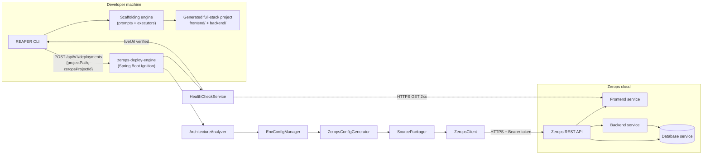
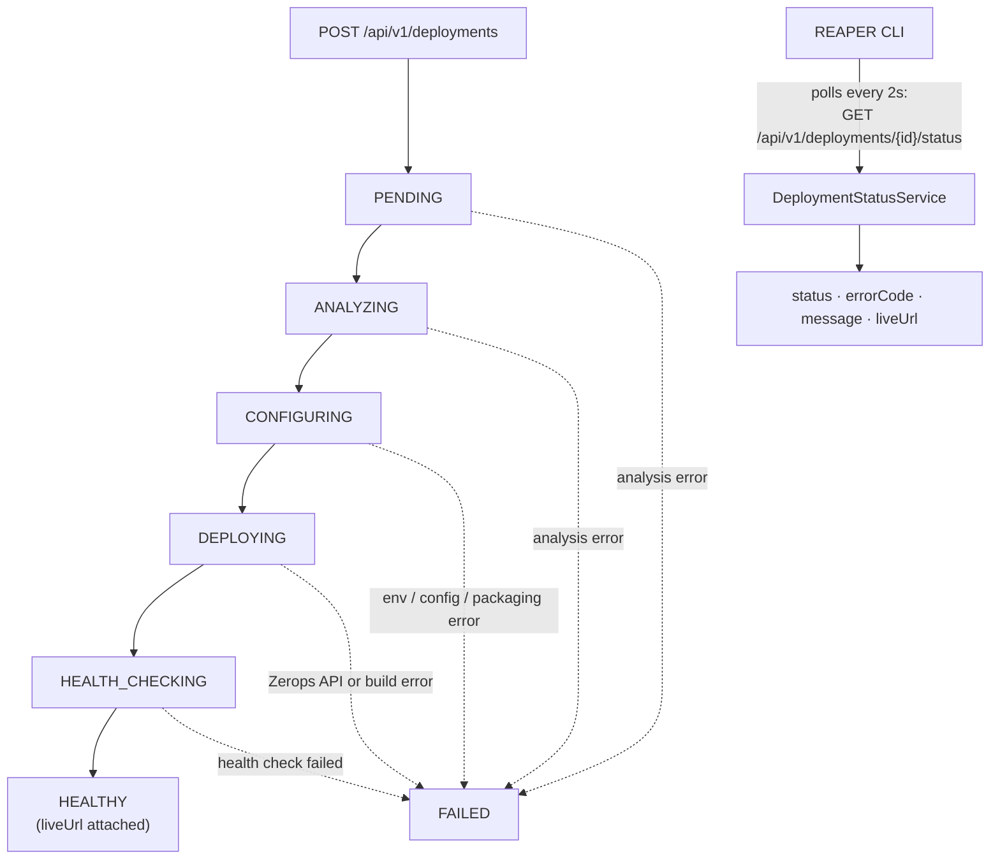
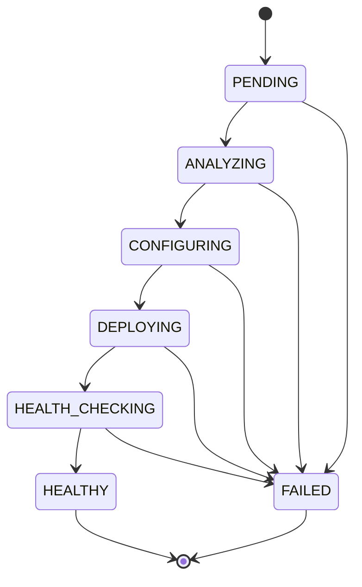

# REAPER

> **Build it. Ship it.**

REAPER is an open-source, terminal-first full-stack project generator. Pick your stack from an interactive menu and REAPER scaffolds a production-shaped application on your machine — then packages it, deploys it to the cloud, and health-checks the live URL, all from one command. No cloud dashboards, no Dockerfiles, no `kubectl`.

---

## Live Demo

🔗 **https://web-2cea-3000.prg1.zerops.app/**

The REAPER landing page is deployed live through **Zerops** (see [`zerops.yaml`](zerops.yaml)).

## GitHub Repository

🔗 **https://github.com/Aaditya022/REAPER**

## Installation

```bash
curl -fsSL https://web-2cea-3000.prg1.zerops.app/install.sh | bash
```

The script checks your OS and dependencies, clones this repository, builds the REAPER CLI from source, and installs it to `~/.local/bin/reaper` (plus the optional deploy engine when Java + Maven are available). See [Quick Start](#quick-start).

---

## Connect

- **GitHub:** https://github.com/Aaditya022
- **LinkedIn:** https://www.linkedin.com/in/aaditya-agrawal-1020803b1/

---

## Why REAPER?

Scaffolding a full-stack app by hand means wiring a frontend, backend, database, ORM, and auth together — and then treating deployment as a second project: hand-writing service configs, fighting a cloud dashboard, and re-doing it every time the stack changes.

REAPER collapses that into a single flow:

1. **You pick the stack** from an interactive terminal menu.
2. **REAPER generates the project** — `frontend/` + `backend/` with the ORM, database, and auth wired in.
3. **The deploy engine (Ignition) takes it live** — it detects the architecture you actually generated, writes the matching Zerops service config, packages your source, deploys it, polls the build, and only reports success after the live URL answers a health check.

The result: a scaffolded, wired, deployed application without a single hand-written deployment file.

---

## Features

Everything below is implemented in this repository.

**Interactive scaffolding (CLI)**
- Arrow-key driven terminal prompts (Bubble Tea + Lipgloss) — no YAML, no hand-written Dockerfiles.
- Three project modes:
  - **Frontend + Backend** — React (JavaScript / TypeScript), UI (TailwindCSS / TailwindCSS + ShadCN), backend (ExpressJS / ExpressTS), ORM (Prisma), database (PostgreSQL / MySQL / MongoDB), auth (JWT / none).
  - **Full Stack Frameworks** — Next.js or Django, with NextAuth, ORM, and database options.
  - **MonoRepos** — Turborepo.
- Generated `frontend/` + `backend/` structure, `.env`, and a local `docker-compose.yml` for the database.

**One-command install**
- `curl -fsSL https://web-2cea-3000.prg1.zerops.app/install.sh | bash` installs the CLI from source (see [`install.sh`](install.sh)).
- Idempotent: re-running updates an existing checkout instead of duplicating it.
- Graceful failures with clear messages for unsupported OS or missing dependencies.

**Deploy engine — REAPER Ignition** (`zerops-deploy-engine/`, Spring Boot)
- **Architecture analysis** — detects the generated project's stack from its filesystem layout (frontend, backend, ORM, database, auth).
- **Config generation** — produces the `zerops.yaml` service definition from per-stack templates.
- **Source packaging** — gzipped tar of the project; `.env`, `.git`, and `node_modules` are excluded so secrets never leave your machine.
- **Zerops integration** — REST client with Bearer-token auth, API base URL override, and per-call timeouts.
- **Async pipeline** — deployments run on a bounded worker pool (`POST /deployments` returns `202` immediately); polling uses back-off (5s → 60s) with a configurable timeout.
- **Health gate** — a deployment is only reported `HEALTHY` after the live URL returns a `2xx`.

**Deployment state machine**
- `PENDING → ANALYZING → CONFIGURING → DEPLOYING → HEALTH_CHECKING → HEALTHY`, with `FAILED` reachable from every non-terminal state. Transitions are validated and terminal states are locked.

**Structured error handling**
- Every failure returns `{ "error": true, "code": "...", "message": "..." }` with stable error codes (e.g. `ZEROPS_API_ERROR`, `UNSUPPORTED_LAYOUT`, `MISSING_REQUIRED_ENV_VARS`).

**Secret handling**
- `ZEROPS_API_TOKEN` / `ZEROPS_PROJECT_ID` live only in local env (`.env.example` templates committed, real `.env` git-ignored).
- Zerops-injected values layer over local `.env`; values are masked in readable representations and never logged.

**Marketing / install site** (`web/`, Next.js)
- Landing page with hero, features, process, infrastructure, security, and a "Run REAPER anywhere" install section (macOS Terminal window, copy button, tabs).
- Serves `/install.sh` so the curl command above works against the live deployment.

---

## Quick Start

### Prerequisites

| Tool | Version used in this repo |
| --- | --- |
| Go | 1.24.4 (`go.mod`; tested with Go 1.26.5) |
| Java | 17+ (`pom.xml` targets Java 17; built with JDK 21) |
| Maven | 3.9.x |
| Node.js | 22.x (for generated projects) |
| npm / pnpm | 10.x / 11.x (for the Next.js marketing site) |
| Docker (optional) | only if you want to run the scaffolded database locally |

### Install with one command

```bash
curl -fsSL https://web-2cea-3000.prg1.zerops.app/install.sh | bash
```

This installs the CLI to `~/.local/bin/reaper`. If `~/.local/bin` is not on your `PATH`, the script prints the one-line `export` to add.

Then scaffold your first project:

```bash
reaper create
```

### Manual build (from source)

```bash
# CLI (repo root)
go build -o reaper .
./reaper create

# Deploy engine
cd zerops-deploy-engine
mvn clean package
java -jar target/stackd-ignition-0.1.0-SNAPSHOT.jar
```

Sanity-check the engine:

```bash
curl http://localhost:8080/api/v1/health
# {"status":"ok"}
```

### Using the CLI

Run `reaper create`, then walk the menus:

1. **Enter project directory** — e.g. `./some-demo`.
2. **Select Project Type** — `Frontend + Backend` / `Full Stack Frameworks` / `MonoRepos`.
3. Pick your frontend, UI, backend, ORM, database, and auth.
4. **"Deploy this to Zerops now?"** — defaults to **No**; choose **Yes** only when you want a live cloud deployment.

The CLI reaches the engine through `STACKD_IGNITION_URL` (default `http://localhost:8080`).

### Live deployment

Requires a real Zerops project id and API token:

```bash
cd zerops-deploy-engine
cp .env.example .env
# edit .env: set ZEROPS_API_TOKEN and ZEROPS_PROJECT_ID
mvn clean package && java -jar target/stackd-ignition-0.1.0-SNAPSHOT.jar
```

In a second terminal, `./reaper create`, choose your stack, and answer **Yes** at the deploy prompt. Watch the terminal stream `ANALYZING → CONFIGURING → DEPLOYING → HEALTH_CHECKING → HEALTHY`, then open the live HTTPS URL.

---

## Architecture

### System



The CLI is deliberately a *scaffolder* — it generates projects and talks to the engine, but knows nothing about Zerops internals. All cloud orchestration lives in Ignition, which runs deployments asynchronously on a bounded worker pool so the HTTP request that accepts a deployment returns immediately (`202`). Health verification is the final gate: a deployment is only `HEALTHY` after the live URL answers `2xx`.

### Deployment pipeline



### Deployment state machine



`HEALTHY` and `FAILED` accept no outgoing transitions — they are terminal. Every other state can fail, and a `HEALTHY` record always means the URL was verified.

---

## Project Structure

```
REAPER/
├── cmd/                          # Cobra CLI entry (create command, banner)
├── internal/
│   ├── fb/                       # Frontend + Backend mode
│   │   ├── promptfb/             #   interactive prompts
│   │   └── executorsfb/          #   file generation (frontend, UI, backend, ORM, auth)
│   ├── fs/                       # Full Stack mode (Next.js / Django)
│   ├── monorepo/                 # MonoRepos mode (Turborepo)
│   ├── deploy/                   # engine HTTP client, polling, confirm prompt, display
│   ├── templates/                # generated-file templates
│   └── utils/                    # shared prompts (dir, type, ORM, DB type, DB URL, directories)
├── zerops-deploy-engine/         # REAPER Ignition — Spring Boot engine
│   ├── src/main/java/com/stackd/ignition/
│   │   ├── api/                  #   controllers, DTOs, error handler
│   │   ├── analyzer/             #   ArchitectureAnalyzer, DetectedStack
│   │   ├── envmanager/           #   EnvConfigManager
│   │   ├── zeropsconfig/         #   ZeropsConfigGenerator + runtime templates
│   │   ├── deployment/           #   DeploymentService, SourcePackager, ZeropsClient
│   │   ├── health/               #   HealthCheckService
│   │   ├── status/               #   Deployment, DeploymentStatus, DeploymentStatusService
│   │   └── config/               #   DeploymentExecutorConfig
│   ├── src/main/resources/zeropsconfig/   # zerops.yaml templates per stack
│   ├── .env.example / application.yml
│   └── status.md                 # stage report on the deploy lifecycle
├── web/                          # Next.js marketing + install site
├── install.sh                    # one-command installer (also served at /install.sh)
├── go.mod / go.sum               # Go 1.24.4, cobra, bubbletea, huh, lipgloss
└── README.md
```

---

## API

Base path: `http://localhost:8080/api/v1` (configurable via `STACKD_IGNITION_URL`).

| Method | Path | Description | Success |
| --- | --- | --- | --- |
| GET | `/health` | Liveness. | `200` → `{"status":"ok"}` |
| POST | `/deployments` | Start a deployment. Body: `{"projectPath": "...", "zeropsProjectId": "..."}` (both required). | `202` → `DeploymentStatusResponse` |
| GET | `/deployments/{deploymentId}` | Full deployment details. | `200` |
| GET | `/deployments/{deploymentId}/status` | Status-only view (`deploymentId`, `status`, `message`, `errorCode`, `liveUrl`). | `200` |
| GET | `/deployments/{deploymentId}/health` | Same status-only view. | `200` |

```bash
curl -X POST http://localhost:8080/api/v1/deployments \
  -H "Content-Type: application/json" \
  -d '{"projectPath":"./some-demo","zeropsProjectId":"YOUR_PROJECT_ID"}'
```

**Error format** (every failure): `{ "error": true, "code": "...", "message": "..." }`

| HTTP | Code | Meaning |
| --- | --- | --- |
| 404 | `DEPLOYMENT_NOT_FOUND` | Unknown deployment id (also after an engine restart — see Known Limitations). |
| 409 | `DEPLOYMENT_ALREADY_IN_PROGRESS` | A deployment for the same `(projectPath, zeropsProjectId)` pair is already in flight. |
| 409 | `INVALID_STATE_TRANSITION` | Illegal status move attempted. |
| 400 | `PROJECT_PATH_INVALID` / `MISSING_REQUIRED_ENV_VARS` / `UNREADABLE_ENV_FILE` | Env/config validation failures. |
| 400 | `NOT_A_STACKD_PROJECT` / `AMBIGUOUS_STACK` / `UNSUPPORTED_LAYOUT` / `UNREADABLE_PROJECT` | Project analysis failures. |
| 502 | `ZEROPS_API_ERROR` | Zerops rejected the request (e.g. bad token → 401). |
| 504 | `ZEROPS_API_TIMEOUT` | A Zerops call timed out. |
| 502 | `ZEROPS_API_UNREACHABLE` | Three consecutive transient failures against Zerops. |
| 502 | `ZEROPS_SERVICE_NOT_FOUND` | Deployed service lookup failed. |
| 502 | `ZEROPS_DEPLOY_FAILED` / `ZEROPS_DEPLOY_TIMEOUT` | Build/deploy failed or exceeded the timeout. |
| 502 | `ZEROPS_RESPONSE_MALFORMED` | Unexpected response shape from Zerops. |

---

## Testing

```bash
# Go CLI: build, vet, unit + regression tests
go build ./...
go vet ./...
go test ./...

# Engine: Spring Boot suite (155 tests)
cd zerops-deploy-engine && mvn test

# Marketing site: production build + TypeScript check
cd web && pnpm install && pnpm exec tsc --noEmit && pnpm build
```

Current verified status: **Spring suite green (155 tests, 0 failures)**, Go `build`/`vet`/`test` all pass, Next.js production build and TypeScript check pass.

---

## Troubleshooting

| Symptom | Cause / fix |
| --- | --- |
| `curl /api/v1/health` fails | Engine not running; start it with `java -jar target/stackd-ignition-0.1.0-SNAPSHOT.jar`. |
| CLI can't reach the engine | Check `STACKD_IGNITION_URL`; default is `http://localhost:8080`. |
| Deploy fails with `ZEROPS_API_ERROR` (401) | Wrong/expired `ZEROPS_API_TOKEN` in `zerops-deploy-engine/.env`. |
| Deploy fails with `MISSING_REQUIRED_ENV_VARS` | `ZEROPS_API_TOKEN` or `ZEROPS_PROJECT_ID` not set. |
| `DEPLOYMENT_NOT_FOUND` after a restart | In-memory store; the deployment pre-dates the engine restart. |
| `UNSUPPORTED_LAYOUT` / `NOT_A_STACKD_PROJECT` | The directory isn't a layout the analyzer recognizes. |
| Database prompt rejects empty URL | A database URL is required when a database type is selected. |
| Scaffold hangs at Vite install | First run downloads npm packages; give it a moment. |

---

## Known Limitations

- **In-memory deployment store** — deployments don't survive an engine restart (`DEPLOYMENT_NOT_FOUND` afterwards).
- **Live deploys need real credentials** — a live Zerops deploy requires a valid `ZEROPS_API_TOKEN` and `ZEROPS_PROJECT_ID`; without them the request fails fast.
- **Defined layout set** — the analyzer recognizes the layouts the generator emits; unusual structures are rejected with `UNSUPPORTED_LAYOUT` (monorepo/workspace layouts included).
- **Drizzle selection** — the ORM menu lists Drizzle, but the CLI currently generates Prisma only; the engine can still detect an existing Drizzle project.
- **Single health probe** — health checking is one HTTPS `GET` expecting `2xx`; no retries and no content checks.
- **External dependency** — live deploys depend on Zerops API availability and rate limits.

---

## GitHub Rules

This repository is public and shared. We follow these rules:

- **No real credentials** — API tokens, passwords, or live account secrets are never committed. Only `.env.example` templates live in the repo; `.env` files are git-ignored.
- **No generated junk** — build outputs (`target/`, `node_modules/`, `dist/`, `.next/`) and local demo directories are git-ignored.
- **Branding** — the user-facing name is **REAPER**.
- **Keep it honest** — every claim in this README, and every diagram, is backed by code and tests in this repo; nothing is invented.
