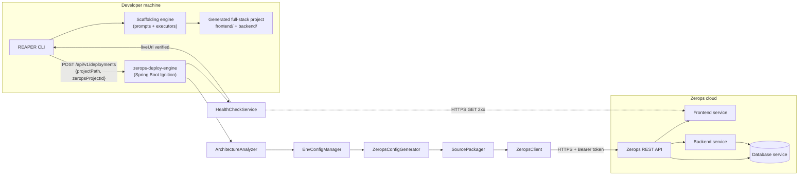
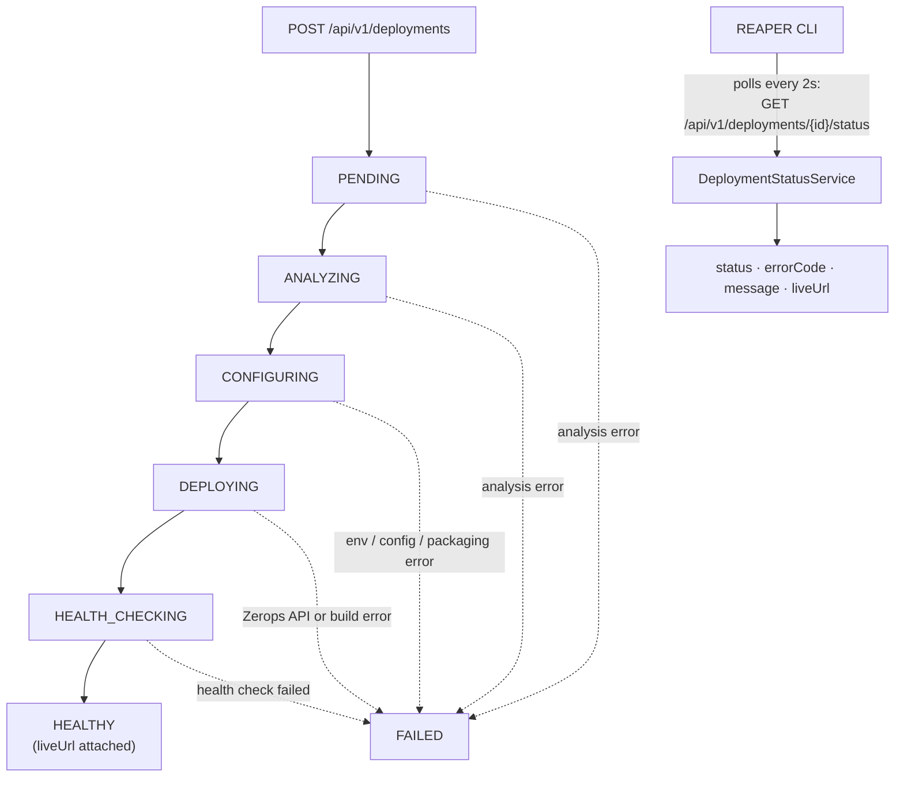
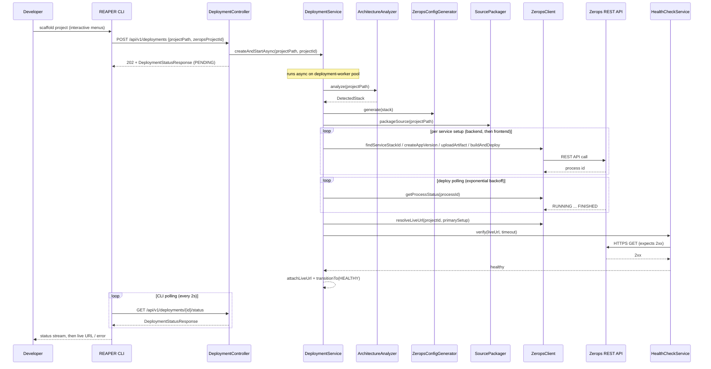
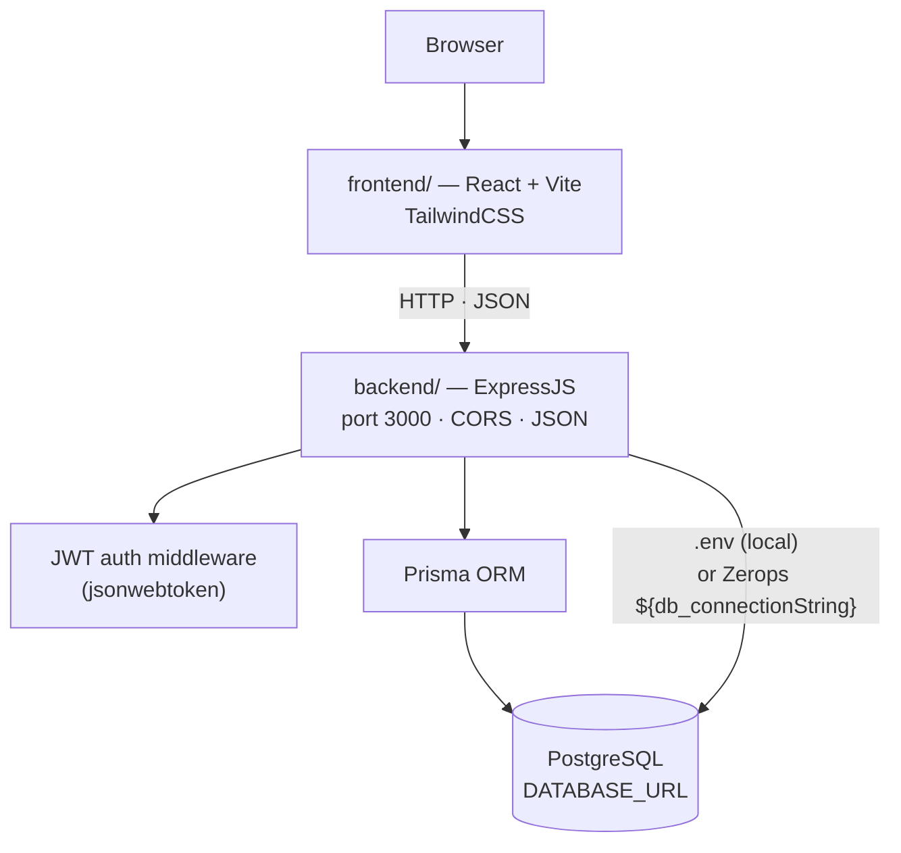
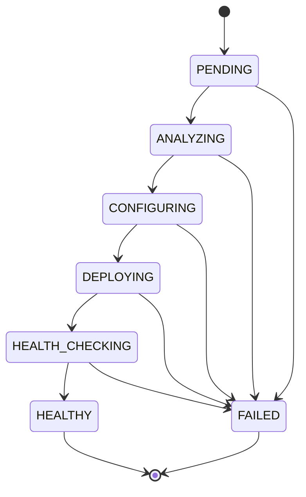
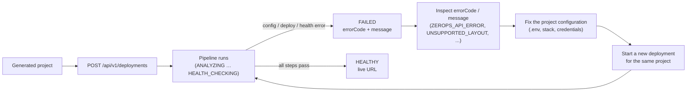
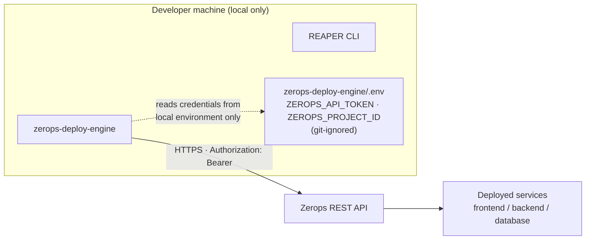

# REAPER

> **Build it. Ship it.**

REAPER is a full-stack project generator that scaffolds a production-shaped application on your machine and then ships it to the cloud for you. Pick your stack from an interactive terminal menu, and REAPER creates the project, configures it, packages it, and deploys it to Zerops — no cloud dashboards, no Dockerfiles, no `kubectl`.

## Table of Contents

- [Demo](#demo)
- [Features](#features)
- [System Architecture](#system-architecture)
- [Deployment Pipeline](#deployment-pipeline)
- [CLI → Ignition → Zerops](#cli--ignition--zerops)
- [Generated Application Architecture](#generated-application-architecture)
- [Deployment State Machine](#deployment-state-machine)
- [Failure Recovery](#failure-recovery)
- [Security](#security)
- [Tech Stack](#tech-stack)
- [Project Structure](#project-structure)
- [Getting Started](#getting-started)
- [Deployment](#deployment)
- [API](#api)
- [Demo / Judge Instructions](#demo--judge-instructions)
- [Testing](#testing)
- [Troubleshooting](#troubleshooting)
- [GitHub Rules](#github-rules)

---

## Demo

**Demo video:** VIDEO_URL_HERE

**Judge demo account:**

| Field | Value |
| --- | --- |
| Email | DEMO_EMAIL_HERE |
| Password | DEMO_PASSWORD_HERE |

---

## Features

- **Interactive scaffolding** — arrow-key driven prompts (no YAML, no hand-written Dockerfiles).
- **Three project modes**:
  - `Frontend + Backend` — React + Express or React + Express (TypeScript), with Prisma, PostgreSQL/MySQL/MongoDB, and JWT auth.
  - `Full Stack Frameworks` — Next.js or Django, with ORM + auth.
  - `MonoRepos` — Turborepo.
- **Instant deploy to Zerops** — the engine builds a Zerops project config (`zerops.yaml`) from a lookup table, injects the database service and credentials, uploads the code, and manages the full deploy + health check.
- **Live status in the terminal** — polling with back-off, printing each state change (2s interval, 10-minute timeout, state changes only).
- **Safe-by-default deploy prompt** — "Deploy this to Zerops now?" defaults to **No**; pressing Enter can never accidentally trigger a cloud deploy.
- **Secrets handled carefully** — database URLs and API tokens are never logged; local `.env` values are layered under injected Zerops values; `.env` files are excluded from the uploaded source archive.
- **A full marketing site** — the repo ships a Next.js landing page (hero, features, how it works, infrastructure, metrics, integrations, security, developers, testimonials, pricing, CTA, footer).
- **Structured failure reporting** — machine-readable error codes and messages from every failure mode.

---

## System Architecture



**Why this shape:** the CLI is deliberately a *scaffolder* — it knows how to generate projects and talk to the engine, but knows nothing about Zerops internals. All cloud orchestration lives in Ignition, a Spring Boot service that runs deployments **asynchronously** on a bounded worker pool so the HTTP request that accepts a deployment returns immediately (`202`) instead of blocking for minutes. Every stage is a single-purpose component, which keeps the pipeline testable and lets failures be attributed to a specific step. Health verification is the **final gate**: a deployment is only `HEALTHY` after the live URL answers `2xx`.

---

## Deployment Pipeline



**Why polling:** the pipeline can take minutes (build, deploy, health check), so Ignition never keeps a connection open for the whole run. The CLI polls the status endpoint every 2 seconds and prints a line only when the state changes; `HEALTHY` and `FAILED` are the **terminal states**. The engine tracks the `(projectPath, zeropsProjectId)` pair while a deploy is in flight, so a duplicate concurrent request is rejected with `409` — but the key is released when the pipeline finishes, so a later redeploy of the same project is allowed (idempotent-ish: one in-flight deploy per project, redeploy always permitted afterwards).

---

## CLI → Ignition → Zerops



**Why the boundaries:** the controller is a thin web layer that only delegates — id generation, validation of state transitions, and the pipeline itself live in services, so there is no orchestration logic in HTTP handlers. Note the two back-ends in the flow: the *engine* polls Zerops for the cloud build (`getProcessStatus`), while the *CLI* independently polls the engine's status endpoint. Nothing here is synchronous: `createDeployment` returns before the pipeline even starts, and every cross-service call is a discrete step that can fail and transition to `FAILED`.

---

## Generated Application Architecture



**Why the generated app is shaped this way:** the default demo stack — React + Vite frontend, ExpressJS backend, Prisma ORM, PostgreSQL, JWT auth — is the stack that exercises the *whole* pipeline (frontend **and** backend setups, a database service with credential injection, and a user-facing URL). The frontend is a Vite SPA that talks to the Express API; the backend enforces JWT auth middleware, reads `DATABASE_URL` (locally from `.env`, in the cloud from the Zerops-injected `${db_connectionString}`), and talks to PostgreSQL through Prisma. The engine deploys the **backend setup first, then the frontend**, and health-checks the frontend URL (the "primary" user-facing service).

---

## Deployment State Machine



This diagram is generated from the `DeploymentStatus` enum's actual transition table. `HEALTHY` and `FAILED` accept **no outgoing transitions** — they are terminal, and the CLI treats them as the end of polling. Every other state can fail: `PENDING → FAILED`, `ANALYZING → FAILED`, `CONFIGURING → FAILED`, `DEPLOYING → FAILED`, `HEALTH_CHECKING → FAILED`. A failed health check fails the deployment **without** attaching a live URL, so a `HEALTHY` record always means "the URL was verified".

---

## Failure Recovery



**Why recovery is manual by design:** the engine never rewrites a broken project or retries a failed deploy automatically. Failures land the deployment in `FAILED` with a stable `errorCode` and human-readable `message`, so the terminal shows exactly *what* broke and *where*. You fix the project, then start a fresh deployment — the in-flight guard on the `(projectPath, zeropsProjectId)` pair is released once the previous run reaches a terminal state, so redeploys are always allowed.

---

## Security



- **No secrets in the repo** — only `.env.example` templates are committed; real `.env` files are git-ignored. `ZEROPS_API_TOKEN` and `ZEROPS_PROJECT_ID` belong in local environment configuration, never in GitHub.
- **No secrets in logs** — the `ZeropsClient` never logs the token, request bodies, or raw response bodies; Zerops error messages describe only the operation and HTTP status.
- **Secrets stay on the machine** — `SourcePackager` excludes `.env` files (at any depth), `.git`, and `node_modules` from the uploaded source archive, so connection strings never leave the developer machine.
- **Environment layering** — Zerops-injected values override the local `.env`; merged values are masked in every readable representation.
- **Safe deploy prompt** — "Deploy this to Zerops now?" defaults to **No**.
- **Bounded reads, fail-closed** — env/config files are read with a 256KB cap, symlinks are not followed, and unresolved `{{placeholder}}` tokens abort config generation.

---

## Tech Stack

| Layer | Technology | Notes |
| --- | --- | --- |
| CLI | Go 1.24 + Cobra + Bubble Tea + Huh + Lipgloss | interactive TUI, scaffold + deploy client |
| Engine | Spring Boot 3.5.16 (Java 17) | `zerops-deploy-engine`, async pipeline |
| Engine HTTP | Java `HttpClient` | Bearer-token calls to Zerops REST API |
| Packaging | Apache Commons Compress | gzipped tar of project source |
| Marketing site | Next.js 16 + React 19 | bundled landing page |
| Scaffolded frontend | Vite + React (JS/TS) · Vue · Angular · Next.js | `create-vite`/templates |
| Scaffolded backend | ExpressJS · ExpressTS · Django (DRF) | |
| Data | PostgreSQL · MySQL · MongoDB | Prisma ORM scaffold; `DATABASE_URL` injection |

---

## Project Structure

```
REAPER/
├── cmd/                          # Cobra CLI entry (create command, banner)
├── internal/
│   ├── fb/                       # Frontend + Backend mode
│   │   ├── promptfb/             #   interactive prompts
│   │   └── executorsfb/          #   file generation (frontend, UI, backend, ORM, auth)
│   ├── fs/                       # Full Stack mode (Next.js / Django)
│   ├── monorepo/                 # MonoRepos mode (Turborepo)
│   ├── deploy/                   # engine HTTP client, polling, confirm prompt, display
│   ├── templates/                # generated-file templates (expressjs, prisma, tailwindcss, ...)
│   └── utils/                    # shared prompts (dir, type, ORM, DB type, DB URL, directories)
├── zerops-deploy-engine/         # REAPER Ignition — Spring Boot engine
│   ├── src/main/java/com/stackd/ignition/
│   │   ├── api/                  #   controllers (DeploymentController, HealthController), DTOs, error handler
│   │   ├── analyzer/             #   ArchitectureAnalyzer, DetectedStack, ProjectLayout
│   │   ├── envmanager/           #   EnvConfigManager, MergedEnv
│   │   ├── zeropsconfig/         #   ZeropsConfigGenerator + runtime templates
│   │   ├── deployment/           #   DeploymentService, SourcePackager, ZeropsClient, exceptions
│   │   ├── health/               #   HealthCheckService
│   │   ├── status/               #   Deployment, DeploymentStatus, DeploymentStatusService, DeploymentStore
│   │   └── config/               #   DeploymentExecutorConfig
│   ├── src/main/resources/zeropsconfig/   # zerops.yaml templates per stack
│   ├── .env.example / application.yml
│   └── status.md                 # stage report on the deploy lifecycle
├── web/                          # Next.js marketing site (landing page)
├── go.mod / go.sum               # Go 1.24.4, cobra, bubbletea, huh, lipgloss
└── README.md
```

---

## Getting Started

### Prerequisites

| Tool | Version used to build this repo |
| --- | --- |
| Go | 1.24.4 (`go.mod`; tested with Go 1.26.5) |
| Java | 17+ (`pom.xml` targets Java 17; built with JDK 21) |
| Maven | 3.9.x |
| Node.js | 22.x (scaffolds target Node 22) |
| npm | 10.x |
| pnpm | 11.x (for the bundled Next.js marketing site) |
| Docker (optional) | Only if you want to run the scaffolded PostgreSQL locally |

No cloud credentials are needed to scaffold or to run the whole test suite.

### Build and run the engine

```bash
cd zerops-deploy-engine
mvn clean package
java -jar target/stackd-ignition-0.1.0-SNAPSHOT.jar
```

- Listens on port `8080` by default (`IGNITION_PORT` to change).
- Loads `zerops-deploy-engine/.env` if present (see [Deployment → Environment Configuration](#deployment)).
- Spring Boot 3.5.16, Java 17, actuator endpoints exposed for health/metrics.

Quick sanity check:

```bash
curl http://localhost:8080/api/v1/health
# {"status":"ok"}
```

### Build and run the CLI

```bash
# from the repo root
go build -o reaper .
./reaper create
```

The interactive flow (arrow keys + Enter):

1. **Enter project directory** — e.g. `./some-demo`
2. **Select Project Type** — `Frontend + Backend` / `Full Stack Frameworks` / `MonoRepos`
3. Depending on your choice, you'll pick through the menus: frontend framework, UI framework, backend framework, ORM, database type, database URL, and auth method.
4. **"Deploy this to Zerops now?"** — defaults to **No**. Choose **Yes** only when you want a live cloud deployment (see [Deployment](#deployment)).

The CLI uses `STACKD_IGNITION_URL` (default `http://localhost:8080`) to reach the engine.

### Hackathon Quick Start

1. Open two terminals.
2. **Terminal 1 — start the engine:** `cd zerops-deploy-engine && mvn clean package && java -jar target/stackd-ignition-0.1.0-SNAPSHOT.jar`
3. **Terminal 2 — scaffold a project (no cloud credentials needed):** `go build -o reaper . && ./reaper create`
4. Enter a project directory (e.g. `./some-demo`), choose **Frontend + Backend**, then:
   - Frontend: **React (JavaScript)** · UI: **TailwindCSS** · Backend: **ExpressJS** · ORM: **Prisma** · Database: **postgresql** · Database URL: any valid PostgreSQL connection string · Authentication: **JWT**
5. At **"Deploy this to Zerops now?"**, choose **No** for the local demo — your project is scaffolded, wired, and ready to run locally.
6. Watch the generated `frontend/` + `backend/` structure appear with a working React + Express + Prisma + PostgreSQL stack.

For the live cloud demo, see [Deployment → Try a Live Deployment](#deployment).

---

## Deployment

### Environment Configuration

**Engine (`zerops-deploy-engine/.env`)** — copy from `.env.example`:

| Variable | Required for live deploys | Default | Purpose |
| --- | --- | --- | --- |
| `ZEROPS_API_TOKEN` | yes | — | Zerops personal access token (Bearer auth to the API). |
| `ZEROPS_PROJECT_ID` | yes | — | Zerops project to deploy into. |
| `IGNITION_PORT` | no | `8080` | Engine HTTP port. |
| `ZEROPS_API_BASE_URL` | no | Zerops public API | API base URL override. |
| `ZEROPS_API_TIMEOUT_MS` | no | — | Per-call timeout to Zerops. |
| `IGNITION_POLL_INTERVAL_MS` | no | `5000` | Deploy poll interval. |
| `IGNITION_MAX_POLL_INTERVAL_MS` | no | `60000` | Back-off ceiling for polling. |
| `IGNITION_POLL_TIMEOUT_MS` | no | `300000` | Total deploy wait before `ZEROPS_DEPLOY_TIMEOUT`. |
| `IGNITION_HEALTH_TIMEOUT_MS` | no | `30000` | Health-check deadline. |
| `IGNITION_DEPLOY_EXECUTOR_POOL_SIZE` | no | `4` | Concurrent deployment slots. |
| `POSTGRES_*` / `MYSQL_*` / `MONGO_*` | no | — | Optional custom service provisioning blocks. |

The engine loads `.env` via Spring's `optional:file:.env` import; secrets are read from the environment, never written into the packaged jar.

**CLI** — `STACKD_IGNITION_URL` points the CLI at the engine (default `http://localhost:8080`).

**Scaffolded project** — REAPER writes a `.env` into the generated project with the database URL you entered, plus a `docker-compose.yml` to run the database locally.

### Try a Live Deployment

> Requires a real Zerops account with a project id and an API token.

1. Start the engine with credentials configured:
   ```bash
   cd zerops-deploy-engine
   cp .env.example .env
   # edit .env: set ZEROPS_API_TOKEN and ZEROPS_PROJECT_ID
   mvn clean package && java -jar target/stackd-ignition-0.1.0-SNAPSHOT.jar
   ```
2. In a second terminal, scaffold with deploy enabled:
   ```bash
   go build -o reaper .
   ./reaper create
   ```
3. Choose your stack, then answer **Yes** at **"Deploy this to Zerops now?"**.
4. Watch the terminal stream: `ANALYZING → CONFIGURING → DEPLOYING → HEALTH_CHECKING → HEALTHY`, then the **live HTTPS URL** is printed.
5. Open the URL — the engine health-checked it (`2xx`) before reporting success.

The engine handles the full Zerops lifecycle for you: project config generation (service templates for your exact stack), database service provisioning with cross-service credential injection, code packaging/upload, sequential backend-then-frontend deploy, back-off polling, and health verification.

### Known Limitations

- **In-memory deployment store** — deployments don't survive an engine restart (`DEPLOYMENT_NOT_FOUND` afterwards).
- **Live deploys need real credentials** — a live Zerops deploy requires a valid `ZEROPS_API_TOKEN` and `ZEROPS_PROJECT_ID`; without them the request fails fast.
- **Defined layout set** — the analyzer recognizes the supported layouts above; unusual structures are rejected with `UNSUPPORTED_LAYOUT`.
- **Drizzle selection** — the ORM menu lists Drizzle, but the CLI scaffolder currently generates Prisma only; the engine can still *detect* an existing Drizzle project.
- **Single health probe** — health checking is one HTTPS `GET` expecting `2xx`; no retries and no content checks.
- **External dependency** — live deploys depend on Zerops API availability and rate limits.

---

## API

Base path: `http://localhost:8080/api/v1` (configurable via the CLI's `STACKD_IGNITION_URL`).

| Method | Path | Description | Success |
| --- | --- | --- | --- |
| GET | `/health` | Liveness. | `200` → `{"status":"ok"}` |
| POST | `/deployments` | Start a deployment. Body: `{"projectPath": "...", "zeropsProjectId": "..."}` (both required). | `202` → `DeploymentStatusResponse` |
| GET | `/deployments/{deploymentId}` | Full deployment details. | `200` |
| GET | `/deployments/{deploymentId}/status` | Status-only view (`deploymentId`, `status`, `message`, `errorCode`, `liveUrl`). | `200` |
| GET | `/deployments/{deploymentId}/health` | Same status-only view. | `200` |

**Request example:**

```bash
curl -X POST http://localhost:8080/api/v1/deployments \
  -H "Content-Type: application/json" \
  -d '{"projectPath":"./some-demo","zeropsProjectId":"YOUR_PROJECT_ID"}'
```

**Error format** (every failure):

```json
{ "error": true, "code": "ZEROPS_DEPLOY_TIMEOUT", "message": "..." }
```

| HTTP | Code | Meaning |
| --- | --- | --- |
| 404 | `DEPLOYMENT_NOT_FOUND` | Unknown deployment id (also after an engine restart — see Known Limitations). |
| 409 | `DEPLOYMENT_ALREADY_IN_PROGRESS` | A deployment for the same `(projectPath, zeropsProjectId)` pair is already in flight. |
| 409 | `INVALID_STATE_TRANSITION` | Illegal status move attempted. |
| 400 | `PROJECT_PATH_INVALID` / `MISSING_REQUIRED_ENV_VARS` / `UNREADABLE_ENV_FILE` | Env/config validation failures. |
| 400 | `NOT_A_STACKD_PROJECT` / `AMBIGUOUS_STACK` / `UNSUPPORTED_LAYOUT` / `UNREADABLE_PROJECT` | Project analysis failures. |
| 502 | `ZEROPS_API_ERROR` | Zerops rejected the request (e.g. bad token → 401). |
| 504 | `ZEROPS_API_TIMEOUT` | A Zerops call timed out. |
| 502 | `ZEROPS_API_UNREACHABLE` | Three consecutive transient failures against Zerops. |
| 502 | `ZEROPS_SERVICE_NOT_FOUND` | Deployed service lookup failed. |
| 502 | `ZEROPS_DEPLOY_FAILED` / `ZEROPS_DEPLOY_TIMEOUT` | Build/deploy failed or exceeded the timeout. |
| 502 | `ZEROPS_RESPONSE_MALFORMED` | Unexpected response shape from Zerops. |

---

## Demo / Judge Instructions

### Demo Project

A React + ExpressJS + Prisma + PostgreSQL scaffold looks like this:

```
some-demo/
├── frontend/            # Vite React app (Tailwind configured, wired to the backend)
│   ├── src/
│   ├── package.json
│   └── vite.config.ts
├── backend/
│   ├── prisma/          # schema.prisma + generated client
│   ├── index.js         # Express server on port 3000 (JWT middleware included)
│   ├── middleware/      # auth.js (jsonwebtoken)
│   ├── .env             # DATABASE_URL
│   └── package.json
├── docker-compose.yml   # local PostgreSQL service
├── .env
└── README.md            # per-project run instructions
```

To run the scaffold locally: `docker compose up -d`, then start `backend` (port 3000) and `frontend` with their respective `npm run dev` scripts.

### Failure Demo

A deliberate failure path is easy to trigger and produces clean, structured output:

- **Invalid project path**: POST a deployment with a nonexistent `projectPath` → `PROJECT_PATH_INVALID` (400).
- **Missing engine credentials**: run a live deploy without `ZEROPS_API_TOKEN` / `ZEROPS_PROJECT_ID` → the env manager fails fast with `MISSING_REQUIRED_ENV_VARS`.
- **Invalid Zerops token**: keep the token wrong → `ZEROPS_API_ERROR` with the HTTP status from Zerops (e.g. 401). The engine logs the operation and status only — never the token.
- **Unsupported layout**: point the analyzer at a directory it can't classify → `UNSUPPORTED_LAYOUT` or `NOT_A_STACKD_PROJECT`.
- **Engine restart mid-flight**: deployments are stored in memory, so a restart makes old ids unknown → `DEPLOYMENT_NOT_FOUND`.

Every failure returns the standard `{"error":true,"code":...,"message":...}` shape so a demo can read the code straight off the terminal.

### 3–5 Minute Demo Flow

1. **Open** — show `go.mod`, `pom.xml`, and the engine + CLI directory layout (30s).
2. **Local scaffold** — `./reaper create`, walk the menus, choose the React + Express + Prisma + PostgreSQL stack, answer **No** at the deploy prompt; show the generated `frontend/` + `backend/` tree (90s).
3. **Failure demo** — point a deploy at a nonexistent path and show the structured `PROJECT_PATH_INVALID` error; or start the engine without credentials and show `MISSING_REQUIRED_ENV_VARS` (60s).
4. **Live deploy** — with credentials configured, run the same scaffold answering **Yes**, stream the lifecycle to **HEALTHY**, and open the printed live URL (90s–2min).
5. **Wrap** — run `go test ./...` and `mvn test` to show the suites green (30s).

---

## Testing

Run each suite from the repo root:

```bash
# Go CLI: unit tests + regression tests for the scaffolder
go build ./...
go vet ./...
go test ./...

# Engine: Spring Boot test suite (controllers, analyzer, env manager,
# config generator, health check, error mapping)
cd zerops-deploy-engine && mvn test

# Marketing site: production build + TypeScript check
cd web && pnpm install && pnpm exec tsc --noEmit && pnpm build
```

Current verified status: **Spring suite green (155 tests, 0 failures)**, Go `build`/`vet`/`test` all pass, Next.js production build and TypeScript check pass.

Regression coverage of note: the scaffolder's Vite command is unit-tested for both absolute and relative project directories, and the full scaffold path was smoke-tested end-to-end (no deploy) producing byte-identical structures for relative and absolute paths.

---

## Troubleshooting

| Symptom | Cause / fix |
| --- | --- |
| `curl /api/v1/health` fails | Engine not running; start it with `java -jar target/stackd-ignition-0.1.0-SNAPSHOT.jar`. |
| CLI can't reach the engine | Check `STACKD_IGNITION_URL`; default is `http://localhost:8080`. |
| Deploy fails with `ZEROPS_API_ERROR` (401) | Wrong/expired `ZEROPS_API_TOKEN` in `zerops-deploy-engine/.env`. |
| Deploy fails with `MISSING_REQUIRED_ENV_VARS` | `ZEROPS_API_TOKEN` or `ZEROPS_PROJECT_ID` not set. |
| `DEPLOYMENT_NOT_FOUND` after a restart | In-memory store; the deployment pre-dates the engine restart. |
| `UNSUPPORTED_LAYOUT` / `NOT_A_STACKD_PROJECT` | The directory isn't a layout the analyzer recognizes. |
| Database prompt rejects empty URL | A database URL is required when a database type is selected. |
| Scaffold hangs at Vite install | First run downloads npm packages; give it a moment. |

---

## GitHub Rules

This repository is shared and graded from the public GitHub repo. Rules we follow here:

- **No real credentials** — API tokens, passwords, or live account secrets must never be committed. Only `.env.example` templates live in the repo; `.env` files are git-ignored.
- **No generated junk** — build outputs (`target/`, `node_modules/`, `dist/`, `.next/`) and local demo directories are git-ignored.
- **Branding** — the user-facing name is **REAPER**.
- **Keep it honest** — every claim in this README, and every node in these diagrams, is backed by code and tests in this repo; nothing is invented.
